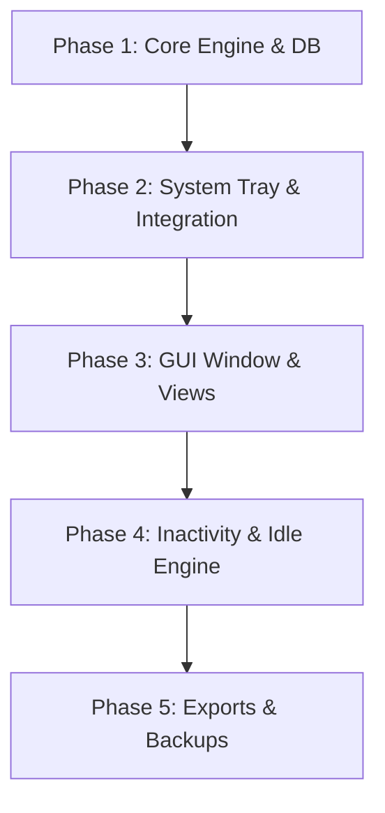

# Chronos

<p align="center">
  
</p>

> A minimalist, intelligent work-time tracker for freelancers and individual professionals.
> Un traqueur de temps de travail minimaliste et intelligent pour freelances et professionnels indépendants.

---

## Overview / Aperçu

**English** | Chronos is a desktop application inspired by *AllNetic Working Time Tracker*, rebuilt with a modern, local-first, privacy-respecting approach. It lives in your system tray, tracks time with a granular project/task hierarchy, detects idle periods, and helps you generate billable reports — all without spyware or cloud dependency.

**Français** | Chronos est une application de bureau inspirée d'*AllNetic Working Time Tracker*, reconstruite avec une approche moderne, locale et respectueuse de la vie privée. Elle réside dans la barre des tâches, suit le temps avec une hiérarchie granulaire projets/tâches, détecte les périodes d'inactivité et aide à générer des rapports facturables — sans logiciel espion ni dépendance au cloud.

---

## Features / Fonctionnalités

### Core Features / Fonctionnalités principales

| English | Français |
|---|---|
| Infinite project/task/sub-task tree structure | Arborescence infinie projets/tâches/sous-tâches |
| Manual time tracking with start/pause/stop | Suivi manuel avec démarrage/pause/arrêt |
| Idle detection with smart return dialogs | Détection d'inactivité avec dialogues intelligents |
| Billable vs non-billable time distinction | Distinction temps facturable / non facturable |
| System tray icon with quick context menu | Icône de la barre des tâches avec menu contextuel |
| Desktop notifications for state changes | Notifications de bureau pour les changements d'état |
| Main GUI window with split tree/journal view | Fenêtre principale avec vue scindée arbre/journal |
| Advanced date range filtering | Filtrage avancé par plage de dates |
| Statistics tooltip dashboard (Today, Yesterday, Week, Month) | Infobulle statistiques (Aujourd'hui, Hier, Semaine, Mois) |
| CSV & report exporter for billing | Export CSV et rapports pour facturation |
| Daily automatic local backups | Sauvegarde automatique quotidienne locale |
| In-memory log buffer & GUI viewer | Capture des logs en mémoire et visionneuse GUI |
| Redraw wakeup for hidden windows | Réveil de l'interface winit depuis la barre des tâches |
| Windows Subsystem compilation (hidden console) | Masquage de la console système sous Windows |
| Dynamic tray menu status label | Statut de suivi en temps réel dans la barre des tâches |

### Guiding Principles / Principes directeurs

- **User decides, not the computer** — No blocking automation or hidden tracking. Every session is validated or adjusted by the user.
- **L'utilisateur décide, pas son ordinateur** — Pas d'automatisation bloquante ni de tracking caché. Chaque session est validée ou ajustée par l'utilisateur.
- **Lightweight & discreet** — Lives primarily in the system tray, out of your way.
- **Léger & discret** — Réside principalement dans la barre des tâches, sans encombrer l'espace de travail.
- **Granular structure** — Infinite nesting of projects, tasks, and sub-tasks with automatic time roll-ups.
- **Structure granulaire** — Hiérarchie infinie avec remontée automatique des temps cumulés.
- **Billing accuracy** — Native distinction between billable and non-billable hours.
- **Précision financière** — Distinction native entre heures facturables et non facturables.

---

## Tech Stack / Stack technique

| Technology / Technologie | Version | Purpose / Rôle |
|---|---|---|
| **Rust** | Edition 2024, MSRV 1.92 | Language / Langage |
| **Tokio** | 1 (full) | Async runtime / Exécution asynchrone |
| **eframe / egui** | 0.34 | GUI framework with `glow`, `x11`, `wayland` |
| **tray-icon** | 0.24 | System tray icon / Icône de la barre des tâches |
| **rusqlite** | 0.32 (bundled) | SQLite database / Base de données SQLite |
| **serde / serde_json** | 1 | Serialization / Sérialisation |
| **anyhow** | 1 | Error handling / Gestion d'erreurs |
| **tracing / tracing-subscriber** | 0.1 / 0.3 | Structured logging / Journalisation structurée |
| **toml** | 1.1 | Config file parsing / Parsing de configuration |
| **rfd** | 0.17 | Native file dialogs / Dialogues de fichiers natifs |
| **directories** | 6 | Platform-standard user directories / Répertoires utilisateur standard |
| **notify-rust** | 4 | Desktop notifications / Notifications de bureau |

### Release optimizations / Optimisations de release

```toml
[profile.release]
opt-level = "z"    # Optimize for binary size / Optimisation taille
lto = "thin"       # Thin link-time optimization / Optimisation fine
codegen-units = 4
strip = true       # Strip symbols / Suppression des symboles
panic = "abort"    # No unwind tables / Pas de tables de déroulement
```

---

## Database Schema / Schéma de base de données

```sql
-- Tasks & projects tree structure / Structure arborescente
CREATE TABLE tasks (
    id INTEGER PRIMARY KEY AUTOINCREMENT,
    parent_id INTEGER REFERENCES tasks(id) ON DELETE CASCADE,
    name TEXT NOT NULL,
    is_project BOOLEAN DEFAULT FALSE,
    is_payable BOOLEAN DEFAULT TRUE,
    is_archived BOOLEAN DEFAULT FALSE,
    created_at TIMESTAMP DEFAULT CURRENT_TIMESTAMP
);

-- Tracked time periods / Périodes de travail enregistrées
CREATE TABLE time_periods (
    id INTEGER PRIMARY KEY AUTOINCREMENT,
    task_id INTEGER REFERENCES tasks(id) ON DELETE CASCADE,
    begin_time TIMESTAMP NOT NULL,
    end_time TIMESTAMP,
    duration_seconds INTEGER DEFAULT 0,
    is_payable BOOLEAN DEFAULT TRUE
);
```

---

## Development Roadmap / Feuille de route



### Phase 1 — Core Engine & Database (✅ Complete)
- [x] SQLite database initialization with schema migrations (`rusqlite` + `directories`)
- [x] Recursive task tree management (nested projects, tasks, sub-tasks)
- [x] Core tracking state machine (`Idle`, `Running`, `Paused`)

### Phase 2 — System Integration (✅ Complete)
- [x] System tray icon with context menu (`tray-icon`) — Start/Stop/Pause/Resume/Quit
- [x] Desktop notifications for state changes (`notify-rust`)

### Phase 3 — User Interface (✅ Complete)
- [x] Main window with full egui layout: status bar, side panel, journal
- [x] Task tree with hierarchical indentation, add/edit/archive/delete
- [x] Period journal grid with task name, start, end, duration, billable
- [x] Task creation dialog (root + sub-task)

### Phase 4 — Idle Detection (✅ Complete)
- [x] Auto-pause after configurable inactivity timeout (5 min default)
- [x] Return dialog on activity resumption
- [x] Idle state management (`Active`, `Idle`, `Returning`)

### Phase 5 — Reports & Exports (✅ Complete)
- [x] Statistics dashboard (Today, Yesterday, Week, Month, Billable)
- [x] CSV export with date and `is_payable` filtering
- [x] Daily automatic SQLite backup with 30-day pruning

### Additional / Supplémentaire
- [x] Desktop notifications for start/stop/pause/resume (cross-platform)
- [x] Task rename and payable toggle from GUI
- [x] Cumulative time per task shown in tree
- [x] DB functions: `rename_task`, `set_payable`

---

## Getting Started / Premiers pas

### Prerequisites / Prérequis

- **Rust** 1.92+ (install via [rustup](https://rustup.rs/))
- **Linux**: System libraries for GUI and tray support

```bash
sudo apt-get install -y \
  libxcb-render0-dev libxcb-shape0-dev libxcb-xfixes0-dev \
  libxcb1-dev libx11-dev libxi-dev libxtst-dev libxkbcommon-dev \
  libgtk-3-dev libatk1.0-dev libcairo2-dev libglib2.0-dev libpango1.0-dev \
  libssl-dev pkg-config
```

### Build & Run / Compilation et exécution

```bash
# Clone / Cloner
git clone https://github.com/JZacharie/chronos.git
cd chronos

# Build and run / Compiler et lancer
cargo run

# Release build / Compilation release
cargo build --release
```

### CI / Local dev checks / Vérifications locales

```bash
# Run the local CI mirror (fmt, clippy, test, build)
# Exécuter le miroir CI local
./local-ci.sh
```

---

## Project Status /État du projet

Current phase: **Phases 1-5 core implementation complete** / **Implémentation complète des phases 1-5**

All core features are implemented with tests (56 unit + 5 integration). The application has:
- SQLite database with integer timestamps and WAL mode
- Full task tree hierarchy (add/edit/archive/delete) via GUI
- Time tracking state machine (Idle/Running/Paused) with tray integration
- egui GUI with status bar, task panel, period journal, and stats dashboard
- System tray icon with clock icon and context menu (Start/Stop/Pause/Resume/Quit)
- Idle detection with auto-pause and return dialogs
- CSV export

All phases du noyau sont implémentées avec des tests (56 unitaires + 5 intégration). L'application dispose de :
- Base de données SQLite avec timestamps entiers et mode WAL
- Hiérarchie complète des tâches (ajout/édition/archivage/suppression) via l'interface
- Machine d'états de tracking (Idle/Running/Paused) avec intégration tray
- Interface egui avec barre d'état, panneau des tâches, journal et statistiques
- Icône de la barre des tâches avec horloge et menu contextuel
- Détection d'inactivité avec pause automatique et dialogue de retour
- Export CSV

---

## Project Structure / Structure du projet

```
chronos/
├── .cargo/config.toml          # Cross-compilation linker config
├── .github/workflows/ci.yml    # GitHub Actions CI
├── src/
│   ├── main.rs                 # Entry point / Point d'entrée
│   ├── lib.rs                  # Library root / Racine de la bibliothèque
│   ├── app.rs                  # App state (tracker + DB + status)
│   ├── backup.rs               # Daily auto-backup & pruning
│   ├── db.rs                   # SQLite database layer
│   ├── export.rs               # CSV export
│   ├── idle.rs                 # Idle detection & auto-pause
│   ├── notify.rs               # Desktop notifications (cross-platform)
│   ├── stats.rs                # Date-range statistics queries
│   ├── tracker.rs              # Time tracking state machine
│   ├── tray.rs                 # System tray icon & menu
│   ├── tree.rs                 # In-memory task tree
│   └── ui.rs                   # egui GUI (panels, tree, journal)
├── tests/
│   └── integration.rs          # Integration tests / Tests d'intégration
├── Cargo.toml                  # Rust manifest / Manifeste Rust
├── Cargo.lock                  # Locked dependencies / Dépendances verrouillées
├── deny.toml                   # cargo-deny policy / Politique de sécurité
├── LICENSE                     # MIT License
├── local-ci.sh                 # Local CI mirror / Miroir CI local
├── 1.md                        # French spec document / Document de specs (FR)
├── issues.md                   # English backlog / Backlog (EN)
└── README.md                   # This file / Ce fichier
```

---

## Feature Requests / Demandes de fonctionnalités

**English** | To request a new feature or ask for a development, please create an issue directly in this repository.
**Français** | Pour toute demande de nouvelle fonctionnalité ou de développement, veuillez créer un ticket (issue) directement dans ce dépôt.

---

## License / Licence

MIT License — Copyright (c) 2026 JZacharie. See [LICENSE](LICENSE) for details.
Licence MIT — Copyright (c) 2026 JZacharie. Voir [LICENSE](LICENSE) pour les détails.
