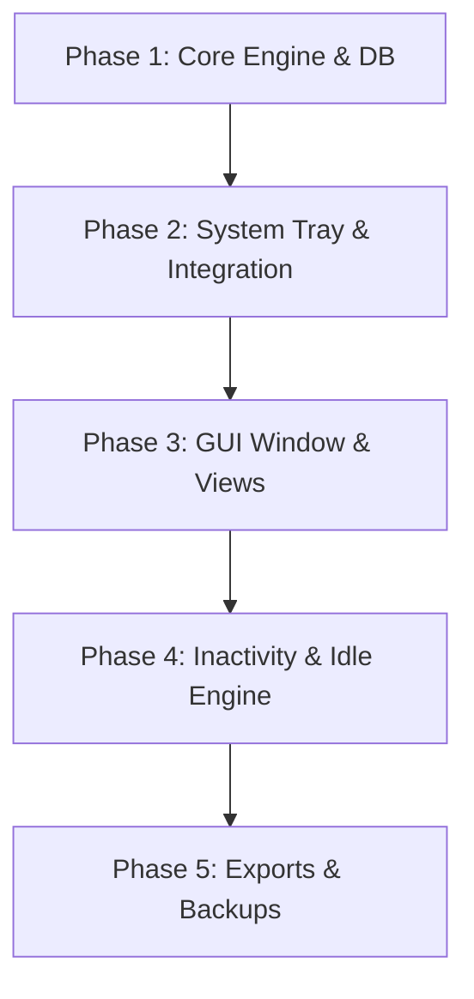

# Chronos — Epic Backlog & Deployment Roadmap

This document outlines the development phases, specific issues, and feature descriptions for the **Chronos** project.

---

## 🗺️ Deployment Roadmap (Phases)

---

## 📋 Epic Backlog & Issues

### Epic 1: Database & Core Time Engine (Phase 1)
* **Issue #1: Database Schema & Migration Manager**
  * **Description:** Initialize SQLite engine using `rusqlite`. Set up database connections and schema migrations for the `tasks` and `time_periods` tables.
  * **Technical Details:** Include default SQLite file paths in the local user data directory using `directories-rs`.
* **Issue #2: Task Tree Management Module**
  * **Description:** Implement recursive tree traversal helper to manage nested tasks (Projets > Tâches > Sous-tâches).
  * **Technical Details:** Calculate cumulative time sums recursively from subtasks up to parent tasks.
* **Issue #3: Core Tracking Engine**
  * **Description:** Create the time tracking controller with basic states (`Idle`, `Running`, `Paused`).
  * **Technical Details:** Thread-safe state managed via `Arc<Mutex<...>>` with channels to communicate tracking events.

### Epic 2: System & Background Integration (Phase 2)
* **Issue #4: System Tray Icon & Context Menu**
  * **Description:** Initialize the application in the system tray (`tray-icon` crate). Enable basic right-click options: Start, Stop, Pause, Switch Task, and Exit.
  * **Technical Details:** Support minimizing the application window to the tray.
* **Issue #5: Desktop Notification Prompts**
  * **Description:** Set up native user alerts for state changes (e.g. "Work period started", "Tracking paused").
  * **Technical Details:** Integrate with the `notify-rust` library for system notifications.

### Epic 3: Main User Interface (Phase 3)
* **Issue #6: Main Window Layout (`egui` / `eframe`)**
  * **Description:** Build the application layout using `eframe` (egui). Split screen layout: left side shows the project tree, right side shows the journal list.
  * **Technical Details:** Implement responsive grid layout with collapsible side panels.
* **Issue #7: Task Manager View**
  * **Description:** Create visual nodes in the tree structure to add, edit, archive, or delete tasks and projects.
  * **Technical Details:** Add indicator icons for billable (`is_payable`) vs non-billable tasks.
* **Issue #8: Period Journal View**
  * **Description:** Display a detailed list of completed time periods for the selected task with start time, end time, duration, and edit/notes option.

### Epic 4: Inactivity Detection (Phase 4)
* **Issue #9: Idle Detection Monitor**
  * **Description:** Set up a background monitor thread checking for user keyboard/mouse activity.
  * **Technical Details:** Trigger idle state if no inputs are received within a configurable timeout (e.g., 5 minutes).
* **Issue #10: Idle Return Dialogs**
  * **Description:** Present a modal on return asking the user how to categorize the idle time:
    1. **Keep:** Log as active work.
    2. **Discard:** Discard the idle duration.
    3. **Retroactive/Split:** Adjust start time or log it under a different task.

### Epic 5: Reports, Billing, & Backups (Phase 5)
* **Issue #11: Stats Tooltip Dashboard**
  * **Description:** Create a quick-view statistics card displaying total tracked time: Today, Yesterday, This Week, and This Month, segmented by project.
* **Issue #12: CSV & Report Exporter**
  * **Description:** Add capability to export tracked tasks for billing purposes. Filter exports by dates and `is_payable` flags.
* **Issue #13: Daily Auto-Backups**
  * **Description:** Automatically clone the SQLite database file to a local backup directory on application launch once per day.

* **Issue #14: Advanced Reports, Time Categories & Pro-Rata Redistribution (Future Dev)**
  * **Description:** Build advanced reporting and time allocation analytics:
    * **Periodic Reports:** Generate daily, weekly, and monthly reports summarizing active time spent per project.
    * **Specific Time Categories:** Native tracking and aggregation of "Team Sync" and "Training" time.
    * **Chronophage Tracking:** Automatically identify and rank the most time-consuming projects.
    * **[Optional] Unallocated Time Redistribution:** Provide a feature to automatically redistribute unallocated (untracked/idle) time proportionally across all active projects based on their active tracking ratios for the day or week.

* **Issue #15: Task Switch Commit Messages & LLM STT Integration (Future Dev)**
  * **Description:** Add support for Git-style log messages and voice note transcriptions when switching/stopping tasks:
    * **Task Commit Messages:** User prompt/input to write a brief explanation of what was achieved during the tracked period (stored alongside `time_periods` in the database).
    * **Audio Voice Recording:** In-app audio recorder module to capture voice notes via the microphone.
    * **LLM STT Integration:** Send audio files to a Speech-To-Text API (e.g., Whisper API) for conversion to commit message text.
    * **Configurable LLM Provider:** App settings panel to define LLM provider endpoints (e.g. OpenAI, custom proxy), API key storage, and model choices.

