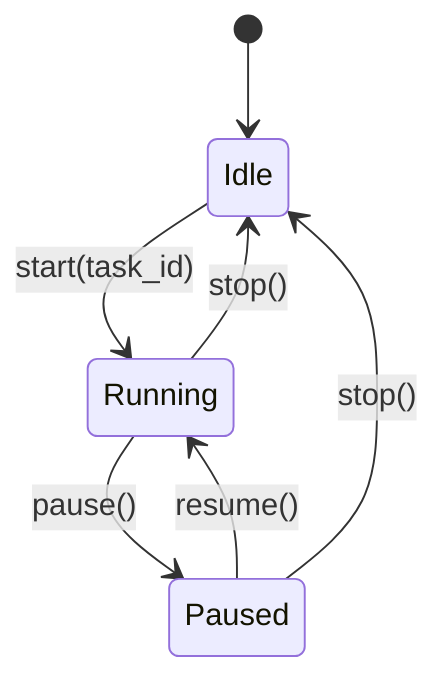

# Chronos — Architecture

This page outlines the technical architecture, data model, and core engines driving the **Chronos** time tracker.

---

## 💾 Data Model (SQLite Schema)

Chronos stores its entire configuration and tracked history in a single local SQLite database file, located in the user's standard application data directory.

```sql
-- Projects and Tasks Tree Structure
CREATE TABLE tasks (
    id INTEGER PRIMARY KEY AUTOINCREMENT,
    parent_id INTEGER REFERENCES tasks(id) ON DELETE CASCADE,
    name TEXT NOT NULL,
    is_project BOOLEAN DEFAULT FALSE,
    is_payable BOOLEAN DEFAULT TRUE,
    is_archived BOOLEAN DEFAULT FALSE,
    created_at TIMESTAMP DEFAULT CURRENT_TIMESTAMP
);

-- Tracked Work Periods
CREATE TABLE time_periods (
    id INTEGER PRIMARY KEY AUTOINCREMENT,
    task_id INTEGER REFERENCES tasks(id) ON DELETE CASCADE,
    begin_time TIMESTAMP NOT NULL,
    end_time TIMESTAMP,
    duration_seconds INTEGER DEFAULT 0,
    is_payable BOOLEAN DEFAULT TRUE
);
```

---

## ⚙️ Core Engines & State Machine

### 1. Time Tracker State Machine
The core tracking engine transitions through three primary states managed by `tracker::TimeTracker`:



* **Idle:** No task is actively tracked.
* **Running:** A task is currently being timed. The start timestamp is recorded.
* **Paused:** Timing is temporarily suspended. Elapsed session duration is accumulated and stored.

### 2. Task Tree Handler
* **Recursive Accumulation:** When querying elapsed time for a parent project node, the engine traverses down the tree recursively compiling time from all child tasks.
* **Database Mapping:** Mapped to memory representations on launch and persisted live to SQLite during updates.
